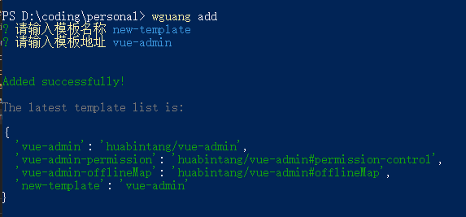
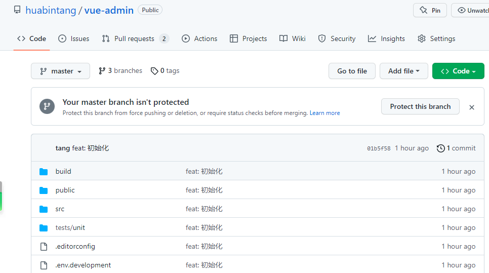
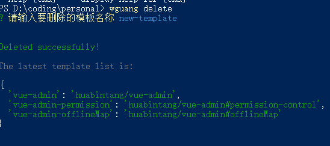
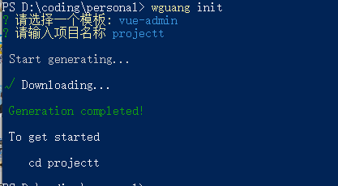

[English](./README.EN.md) | 简体中文

<p align="center"></p>

<h2 align="center">wguang-cli（一个简单的前端CLI工具）</h2>
<p align="center"><b>基于Node搭建生成个人前端脚手架（vue）</b></p>

# 目录

- [特性](#特性)
- [快速入门](#快速入门)
  - [安装](#安装)
  - [用法](#用法)
- [贡献者们](#贡献者们)
- [维护者](#维护者)
- [License](#license)

### 特性

- 简单易用
- 支持自定义模板增删

## 快速入门

### 安装

```bash
$ npm i wguang-cli -g               # install cli
$ omi init my-app     # init project, you can also exec 'omi init' in an empty folder
$ cd my-app           # please ignore this command if you executed 'omi init' in an empty folder
$ wguang init [templateName] [yourProjectName]
```

安装说明:

默认的脚手架模板名称是vue-admin
> wguang init vue-admin [yourProjectName]

### 新增模板用法

```bash
wguang add
# 选择模板和模板地址（github地址）
```



- 注意：模板地址为git仓库名称 默认拉取master分支
 如果想指定分支 请使用 **owner/name#my-branch**的方式


### 删除模板用法

```bash
wguang delete
# 选择模板
```



### 查看所有模板用法

```bash
wguang list
```

### 初始化项目脚手架用法

```bash
wguang init 或者 wguang init [templateName] [yourProjectName]
```




## 贡献者们
- huabintang

## 维护者

- [huabintang](https://github.com/huabintang)

## License

- [MIT](https://opensource.org/licenses/MIT)
